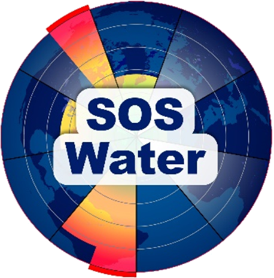
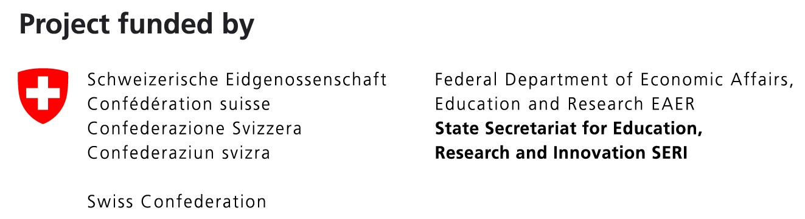

#  SOS-Water - SWOT Lake and River Explorer
[](https://doi.org/10.3030/101059264)

This repository contains a responsive data explorer based on Leaflet and Plotly for data from the Surface Water and Ocean Topography (SWOT) mission.

A mapview allows to display lake, river reach and river node geometries from the SWOT Prior Lake and SWOT SWORD River Dataset served by THEIA Hydroweb GeoServer. Selecting features allows to load and plot corresponding SWOT Level 2 River and Lake Single-Pass data server over the Hydrocron API.

Additional features include an observation frequency layer, a geosearch integration, line fitting based on LOWESS as well as download capabilities for raw data and figures.

This repository is part of SOS-Water project - Water Resources System Safe Operating Space in a Changing Climate and Society ([DOI:10.3030/101059264](https://cordis.europa.eu/project/id/101059264)). Other code contributions to D3.2 can be found at the [SOS-Water - WP3 Earth Observation repository](https://gitlab.eawag.ch/surf/remote-sensing/sos-water/sosw_wp3).

Check out the project website at [sos-water.eu](https://sos-water.eu) for more information on the project.

## How to use
### Web-hosting architecture

The production frontend is fully static and can be hosted with GitHub Pages.

```text
GitHub Pages
  ├── index.html and assets/
  └── data/orbit/processed/*.fgb
       └── direct browser FlatGeobuf viewport queries

Cloudflare Worker
  ├── /api/wfs       -> Hydroweb GeoServer
  └── /api/hydrocron -> PO.DAAC Hydrocron
```

Hydroweb currently returns WFS data without an `Access-Control-Allow-Origin`
header, so browser `fetch()` calls from GitHub Pages are blocked by CORS. The
Worker only forwards the two upstream APIs and adds the required CORS response
headers. It performs no geospatial processing.

The orbit layers do not use the Worker. The browser reads the spatially indexed
FlatGeobuf files directly from the same GitHub Pages origin, using HTTP Range
requests and the current Leaflet bounding box.

### Local deployment

Install dependencies and start the bundled FastAPI server:

```bash
python -m venv .venv
source .venv/bin/activate       # Windows: .venv\Scripts\activate
pip install -r requirements.txt
uvicorn server:app --host 127.0.0.1 --port 8000 --reload
```

Open `http://127.0.0.1:8000`. With `apiBaseUrl: ''`, WFS and Hydrocron use the
local FastAPI proxy. Orbit FlatGeobuf is read directly as a static file in both
local and production modes.

### Generate SWOT orbit layer

To visualize the SWOT observation frequency layer the repository must contain these generated FlatGeobuf files:

```text
data/orbit/processed/swot_overlaps.fgb
data/orbit/processed/swot_nadir.fgb
```

These can be generated using the [SWOT operational orbit data](https://www.aviso.altimetry.fr/en/missions/current-missions/swot/orbit.html) with:

```bat
python preprocess_orbit_vectors.py ^
  --swath E:\path\to\swot_swath.shp ^
  --nadir E:\path\to\swot_nadir.shp
```

### Deploy Cloudflare Worker

1. Copy `wrangler.toml.example` to `wrangler.toml`.
2. In `worker.js`, replace `https://YOUR_USERNAME.github.io` with the exact
   Pages origin. For a project site this is still the origin only, without the
   repository path.
3. Deploy:

```bash
npx wrangler deploy
```

4. Put the resulting Worker origin into `assets/config.js` and redeploy Pages.

The Worker accepts only the known Hydroweb layers and Hydrocron feature types;
it is not a general-purpose open proxy.

## Disclaimer
Views and opinions expressed are those of the author(s) only and do not necessarily reflect those of the European Union or CINEA. Neither the European Union nor the granting authority can be held responsible for them.

## Acknowledgement of funding

<table style="border: none;">
  <tr>
    <td>
      <a href="https://research-and-innovation.ec.europa.eu/funding/funding-opportunities/funding-programmes-and-open-calls/horizon-europe_en">
        
      </a>
    </td>
    <td>This project has received funding from the European Union’s Horizon Europe research and innovation programme under grant agreement No.</td>
  </tr>
</table>

<table style="border: none;">
  <tr>
    <td>
      <a href="https://www.sbfi.admin.ch/sbfi/en/home.html">
        
      </a>
    </td>
    <td>This project has received funding from the Swiss State Secretariat for Education, Research and Innovation (SERI).</td>
  </tr>
</table>
